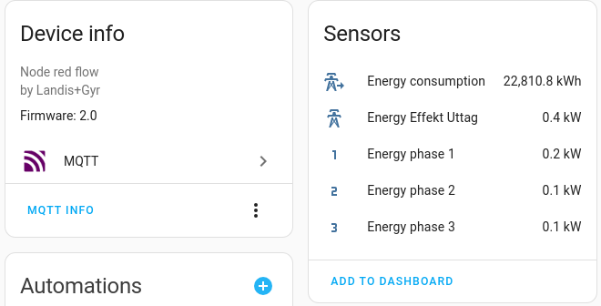

# Landis+Gyr energy metrics to Home assistant

Creates Home assistant sensors using mqtt monitor power consumption by serial interface.

## Installation

### Docker run
```cmd
docker run -it --rm -p 1880:1880 --name p1power /
-e MQTTServer=mqtt.dev.local -e mqttserverport=1883  /
  --device /dev/USB2:/dev/ttyUSB0 klaspihl/node-red-p1power
```

### Docker-compose
```yaml
services:
  nodered:
    image: klaspihl/node-red-p1power:latest
    environment:
      - MQTT_Server=mqtt.dev.local
      - MQTT_Server_Port=1883
    ports:
      - "1880:1880"
    devices:
      - /dev/USB2:/dev/ttyUSB0
```


## Usage

MQTT server and port configurable by environment variables. If credentials is needed open flow and set.

Admin password to node-red: power

## Project
[Github](https://github.com/klaspihl/Node-Red-p1power)

## Result
Home assistant entities


## Apexcharts


### apexcharts-card yaml
```yaml
type: custom:apexcharts-card
graph_span: 1h
yaxis:
  - max: '|+0|'
    decimals: 1
    opposite: true
hours_12: false
stacked: true
series:
  - entity: sensor.energy_meter_energy_phase_1
    name: L1
    color: gray
    stroke_width: 1
    type: area
    group_by:
      func: max
      duration: 1m
  - entity: sensor.energy_meter_energy_phase_2
    name: L2
    color: darkgray
    stroke_width: 1
    type: area
    group_by:
      func: max
      duration: 1m
  - entity: sensor.energy_meter_energy_phase_3
    name: L3
    color: darkblue
    stroke_width: 1
    type: area
    group_by:
      func: max
      duration: 1m
  - entity: sensor.energy_meter_energy_effekt_uttag
    name: total
    stroke_width: 0
    group_by:
      func: max
      duration: 1m
```